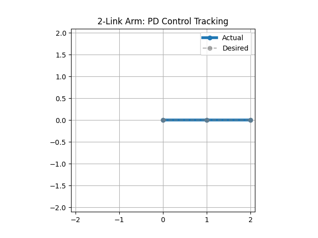

# 2-Link Planar Arm

This repository contains a simplified example implementation of a planar 2-degree-of-freedom (2-DOF) robotic arm kinematics in C++.

## Features

- **Forward kinematics:** Compute the end-effector position from given joint angles.
- **Inverse kinematics:** Calculate possible joint angles for a desired end-effector position.
- **Jacobian computation:** Relate joint velocities to end-effector velocity.
- **Singularity detection:** Detect singularities based on the Jacobian determinant.
- **Trajectory planning:** Basic joint space and Cartesian trajectories for the arm.
- **Collision checking:** Simple collision detection with workspace obstacles and self-collision checks.

## 🦾 Joint-Space PD Control Simulation

This animation shows a 2-link planar arm tracking a desired joint trajectory using a PD controller.

The dashed gray line represents the **desired motion**, while the solid line is the **actual joint motion**.

The animation was generated using a Python script based on data output from the C++ simulation.
You can find the script [here](scripts/animate_arm.py).

## Purpose

This example serves as a foundation for learning robotic manipulator kinematics, trajectory planning, and basic collision avoidance for educational purposes. The code is modular and designed for easy extension toward more advanced motion planning and control.

## Status

Work in progress — continuously adding more functionalities.

## Author

joaquinoc01

## License

This project is open for everyone to use and learn from.
